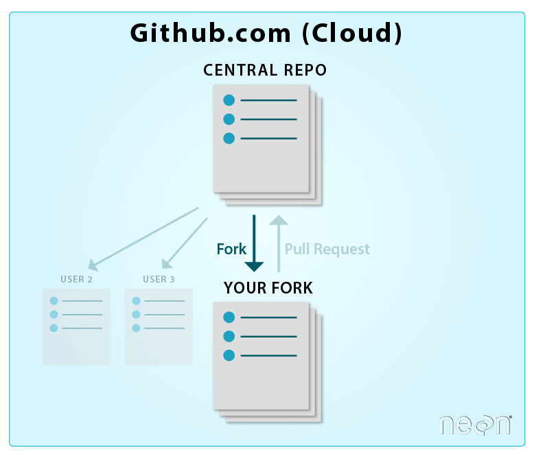

# Challenge 1 - Get the source code ready

 **[Home](../README.md)** - [Next Challenge [2] >](./Challenge02.md)

## Pre-requisites

- Your personal GitHub handle (account)

## Introduction

What is GitHub?

GitHub is a largest online software development platform used for storing, tracking, and collaborating on software projects. As of November 2021, GitHub had over 73 million developers and more than 200 million repositories (including at least 28 million public repositories). GitHub offers free and paid products for storing and collaborating on code. Some products apply only to personal accounts, while other plans apply only to organization and enterprise accounts. With GitHub Free for personal accounts, you can work with unlimited collaborators on unlimited public repositories with a full feature set, and on unlimited private repositories with a limited feature set.

What are forks?

A fork is your own copy of a repository. Forks let you make changes to a project without affecting the original repository. Forking a repository is similar to copying a repository. 

## Description

For this challenge we are going to:
1. Fork the source code of the website from someone's repository to your own

## Success Criteria

- Demonstrate your coach that you have code in your repository
- You should be able to show your Azure subscription
- You should be able to demonstrate your understanding of the solution blueprint to your coach

## Learning Resources

- [Domain Name System (DNS)](https://en.wikipedia.org/wiki/Domain_Name_System)
- [Azure DNS Service](https://docs.microsoft.com/en-us/azure/dns/dns-overview)
https://docs.github.com/en/pull-requests/collaborating-with-pull-requests/working-with-forks/about-forks

