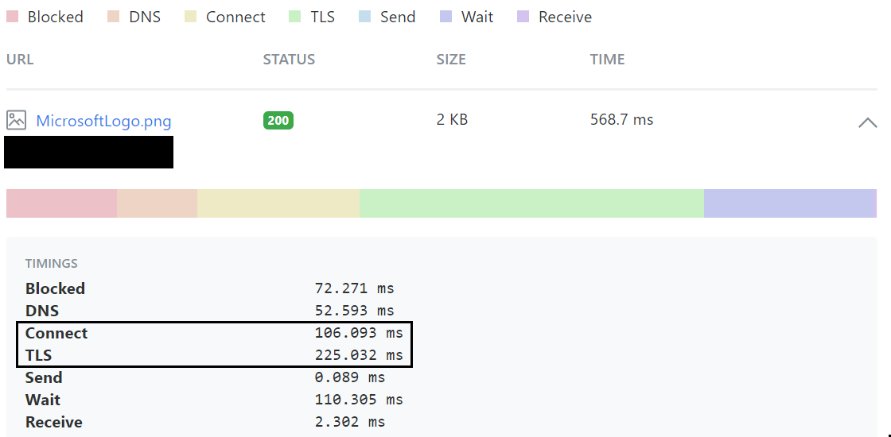
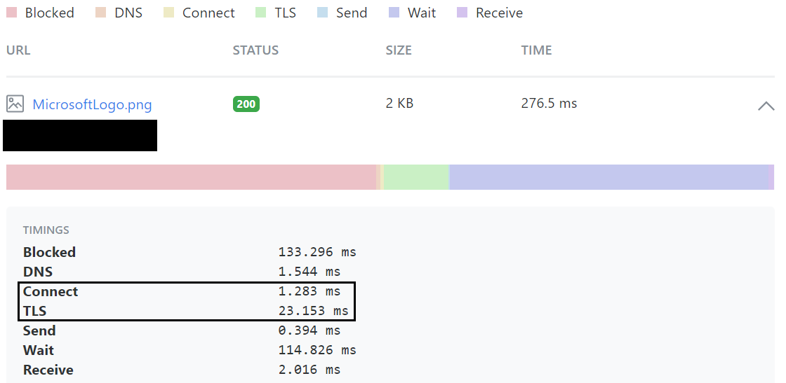

# Challenge 3 - Move ContosoMasks closer to customers

[< Previous Challenge [2]](./Challenge02.md)&nbsp;&nbsp;-&nbsp;&nbsp;**[Home](../README.md)**&nbsp;&nbsp;-&nbsp;&nbsp;[Next Challenge [4] >](./Challenge04.md)

## Introduction

Now that we have the site up and running, it's time to start addressing the situation.  Contoso Masks website has started to trend and LOTS of people are hitting the website from all over the world.  Users are complaining about either taking a really long time to load the website or not able to load at all.

### Global Reach of a website

For the purpose of this description, lets pretend Contoso Masks' website is hosted in the Central US Azure Data Center only, somewhere the State of Iowa.  If a user is accessing the website in the middle of the United States, most likely has a descent experience.  But what happens when the website is accessed from Germany? 

When talking about the performance characteristic of a single resource request (a single GET/POST/etc...), there are 6 numbers that used to describe it:
1. **DNS Lookup** - This is the time it takes the browser to perform a DNS lookup, or translating www.contosomasks.com to an IP Address.
2. **Connect** - How long does it take for the Web Browser to establish a connection to "server" for the request.  Server is the external ***thing*** that is responding to the request.   *HINT* - This isn't always your webserver.
3. **TLS Handshake** - How long does it take your Web Browser to safely establish a secure tunnel to the server.  The [Transport Layer Security (TLS) Handshake Protocol](https://docs.microsoft.com/en-us/windows/win32/secauthn/tls-handshake-protocol) is the established process to safely ensure when you go to www.contosomasks.com, you really are going to the real one.  (The internet can be a very dark place).  **The issue is, this is several round trips from Web Browser to server**
   1. [Man in the middle attack](https://en.wikipedia.org/wiki/Man-in-the-middle_attack) is one example of what this protects.
4. **Send Request** - Time to transmit the HTTP Request.
5. **Wait for Response** - Time for the First Byte of the response to be received.
   1. Sometimes referred to as Time to First Byte [TTFB]
6. **Receive Response** - Time for full payload to receive.
   1. Sometimes referred to as Time to Last Byte [TTLB]

#### Things you control with code of your website:
- #5 is basically what your web application is processing + transit time for the first byte of response.  Once you've optimized the application, we have 5 left.

#### Where Front Door helps

Since Microsoft is the [2nd largest Telecommunications company](https://docs.microsoft.com/en-us/azure/networking/microsoft-global-network) by measure of the amount of [Dark Fibre](https://en.wikipedia.org/wiki/Dark_fibre) run around the planet, you can use this as your accelerated pathway to your website.

There are 2 primary benefits: 
1. By moving the *"Server"* closest to the user (the Point of Presence), the per user Connect (#1) and TLS Handshake (#2) happens closest to the user. 
  - Here are the before and after Front door implementations for a website, using a Germany => Central US test to illustrate:
    - Before Front Door: 
    - After Front Door: 
2. For global (and regional performance), taking advantage of the private pathing thru Microsoft's network provides a way to predictably accelerate requests to and from your website.  Public internet routing is reliable from the aspect of getting your requests back and forth, but unpredictable from a performance perspective.

## Description

For this challenge we are going to:
- Provision Azure Front Door resource and configure it to route requests to your website

## Success Criteria

- Demonstrate the website working thru Front Door endpoint
  - ***HINT*** - You will see **x-azure-ref** in the Response Headers of each request to Front Door.
- With 2 Browser windows open to [https://tools.keycdn.com/performance](https://tools.keycdn.com/performance), test the https://**YOURSITENAME**.azurewebsites.net/ vs https://**YOURFRONTDOOR**.z01.azurefd.net performance. Make sure to run it 3 times prior looking at a final result.
  - Compare the connect and TLS times. What has changed? Explain the difference to your coach
 
## If time permits: Advanced Challenge

- Demonstrate that only the Azure Front Door service can access your website

# What is not in the scope of this challenge
- There is no need to implement Caching at the time.
- We aren't focusing on regional data compliance issues (GDPR for example). 

## Learning Resources

- [Azure Front Door](https://docs.microsoft.com/en-us/azure/frontdoor/front-door-overview)
- [Quickstart: Create an Azure Front Door service using Azure Portal](https://docs.microsoft.com/en-us/azure/frontdoor/quickstart-create-front-door)
